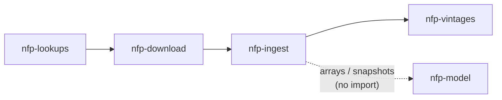

# The Package Chain

`alt-nfp` is a `uv` workspace of five packages. The four data packages form a
**strict linear dependency chain**; the model package sits apart.

## Packages and roles

| Package | Role |
|---|---|
| **nfp-lookups** | Foundation: schemas, industry/geography hierarchies, revision schedules, series-ID grammar, **canonical paths** (`nfp_lookups.paths`). Imports **no** other `nfp_*` package — ever. |
| **nfp-download** | HTTP clients/scrapers for BLS + FRED. Fetching only, no transformation. |
| **nfp-ingest** | Vintage store API, as-of censoring, panel/growth construction, provider compositing, indicators, and the **knowability + snapshot boundary**. |
| **nfp-vintages** | Historical vintage reconstruction pipeline + the `alt-nfp` CLI (top of the chain). |
| **nfp-model** | JAX/NumPyro inference: ModelData arrays in → posterior out. Never sees a `vintage_date`. |

## Dependency diagram

The dashed arrow from `nfp-ingest` to `nfp-model` is **not an import** — it
represents the serialized artifact boundary: `nfp-ingest` bakes a hash-pinned
`.npz` snapshot; `nfp-model` consumes those arrays via its own `data.py`
intake module. There is no Python import relationship between the two.

## nfp-model isolation

`nfp-model` imports **only** `jax`, `numpyro`, and `numpy` — no `nfp_*`
package is ever imported, enforced by
`test_model_unit.py::TestBoundary`. A structural consequence: **importing
`nfp_model` enables JAX float64 globally** (`numpyro.enable_x64()` is called
at import time). The parity contract is defined in double precision; callers
should be aware of this side-effect.

## Why this structure

The deliberately one-directional import graph is the spine of the architecture.
It guarantees that "the model never sees a `vintage_date`" is a structural rule,
not a convention — the model layer simply has no code path to reach vintage store
data. The hash-pinned `.npz` snapshot is simultaneously the censoring contract,
the GPU-batching enabler, and the parity-gate anchor.
