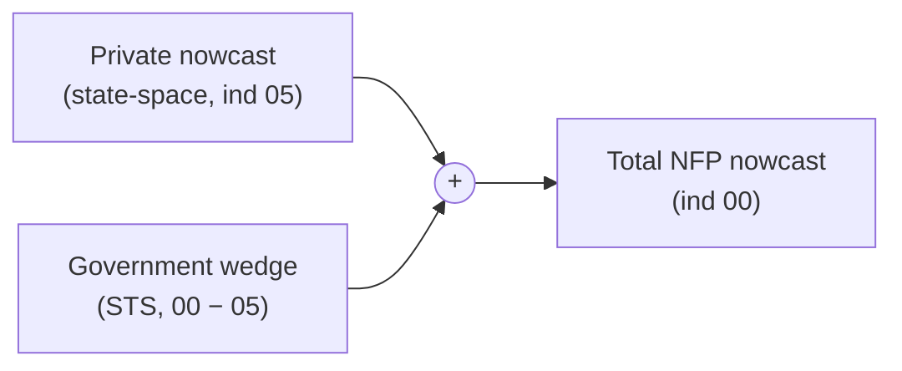

# Additive Nowcast Framework — Overview

`alt-nfp` does not model total nonfarm payrolls directly. It models the part it
can actually see — **private** employment — and reconstructs the total by adding
a separately forecast **government wedge**. This page lays out that additive
framing; the two pages that follow detail each component model.

## The identity

The framework is built on a simple additive identity. Writing `'00'` for total
nonfarm and `'05'` for total private (the BLS `industry_code` values), the
government wedge is what remains:

$$
\text{wedge} = \text{Total}\,('00') - \text{Private}\,('05')
$$

so the total is recovered by adding the private nowcast and the wedge forecast
back together:

$$
\text{Total NFP nowcast} = \underbrace{\text{Private}\,('05')\ \text{nowcast}}_{\text{state-space model}}
  \; + \; \underbrace{\text{Government wedge}\,('00 - '05')\ \text{forecast}}_{\text{STS model}}
$$

Because the wedge is defined as `00 − 05` from the *same first-print release*,
adding it back reproduces the published total **by construction** — there is no
seasonal-adjustment additivity residual and no reconciliation step to tune.

## Why `'05'` is the modeling target

Total private (`'05'`) is the object the model can genuinely forecast:

- **It is anchored to QCEW**, which in this store is a private-employment
  census — the administrative truth the state-space model leans on.
- **Its richest inputs are private** — payroll-provider microdata, the earliest
  and most granular signal available, covers private employment only.
- **The model cannot see government employment.** Federal/state/local hiring is
  driven by budgets, statute, and discrete events (e.g. reductions in force),
  not by the cyclical and payroll signals the state-space model consumes.

So the private nowcast is scored against the *private* first print and *private*
QCEW-settled truth — the comparisons it can legitimately be held to.

## Why total `'00'` is decomposed, not modeled directly

Modeling `'00'` directly would force a single model to explain two processes
with different drivers: the cyclical, signal-rich private series and the
event-driven government series. Decomposing instead lets each component use the
method that fits it:

- the **private** component gets the full Bayesian state-space treatment, where
  its leading indicators and provider data earn their keep;
- the **government wedge** gets a thin structural time-series (STS) model whose
  complexity is spent where a public forecaster has no edge — discrete,
  announcement-priored interventions (such as federal RIF magnitudes).

The total then assembles by an independent draw-wise convolution of the two
posteriors, preserving uncertainty from both legs rather than point-adding them.

## How total-NFP consensus maps onto the framework

Published consensus (e.g. the Bloomberg survey) forecasts the **total** number,
`'00'`. It therefore has no meaning against the private nowcast alone — comparing
consensus to the `'05'` nowcast would be a category error. Consensus is scored
against the **assembled total**: `Private('05') nowcast + Government wedge`, the
right-hand side of the identity above. The framework exists in part so that the
product which competes with consensus — Total NFP — is assembled from a private
nowcast the model can actually justify, plus an explicit, separately auditable
government forecast.

!!! note "Code term: Track A / Track B"
    In the source these two comparisons are called **Track A** and **Track B**.
    Track A is the standalone **private** (`'05'`) nowcast, scored against the
    private first print and private QCEW truth (naive floors as the only
    competitors). Track B is the **Total-NFP product** — the private nowcast
    *plus* the government wedge, assembled and scored against the total first
    print and against consensus. The government wedge is one component *inside*
    Track B, not Track B itself.
