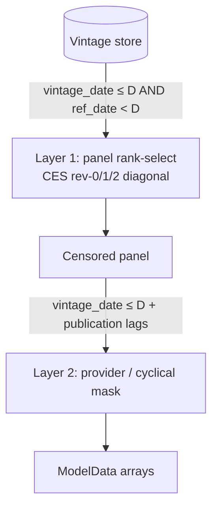

# Vintage data model & as-of censoring

`alt-nfp` nowcasts what the BLS will print *next*, using only what was knowable
on a given day. That discipline is enforced by two things working together: a
**vintage store** that records every version of every estimate as it was
published, and a **two-layer as-of censoring** that reconstructs the exact
information set available on any past horizon date. This page describes both.

## What a real-time vintage is

Official employment series are revised. The CES (Current Employment Statistics)
estimate for a reference month is published three times — a first print, then a
second and third revision in the two following monthly releases — and is
re-anchored once a year to the QCEW (Quarterly Census of Employment and Wages)
benchmark. QCEW itself is revised on a quarterly cadence. The number you read
for, say, July 2025 depends entirely on *when* you read it.

A **vintage** is one such published version, stamped with the date it became
available. The store keeps them all rather than overwriting. Each row carries:

- `ref_date` — the reference month the estimate describes;
- `vintage_date` — the date that version was published (the release date, whose
  day-of-month varies);
- `revision` — the print ordinal (0 = first print, 1 = second, 2 = third);
- `benchmark_revision` — non-zero once the annual benchmark has re-anchored the
  level history;
- the `employment` level itself (the store holds **levels only** — growth is
  derived at read time, see below).

Keeping the full vintage history is what makes honest backtesting possible: to
ask "what would the model have nowcast in February 2025?" you must feed it the
estimates that existed *then*, not today's revised values. Using a later vintage
would leak the future into the past (lookahead bias).

## The Hive-partitioned store

The vintage store is a Hive-partitioned Parquet dataset, partitioned by
`source` × `seasonally_adjusted`:

```
source=ces/seasonally_adjusted=true/   v_<vmin>_<vmax>_<hash>.parquet
source=ces/seasonally_adjusted=false/  …
source=qcew/seasonally_adjusted=false/ …
```

Partitioning on these two keys lets the reader push partition predicates into
the scan (`read_vintage_store(source="ces", seasonally_adjusted=True, …)`), so
only the relevant Parquet files are opened. Industry and geography are **row
columns**, not partition keys: the private/total split (`industry_code` `'05'`
vs `'00'`) and national/state geography live inside each partition's files. The
store lives in MinIO/S3 in production (`NFP_STORE_URI`), with a local
`data/store/` fallback for development and CI.

!!! note "Growth is computed at read time, not stored"
    `VINTAGE_STORE_SCHEMA` has no growth column. `transform_to_panel` derives
    month-over-month log-growth when it reads the store. The append path moves
    **levels** only, so "how release files are diffed against the store" never
    affects a growth value — it only controls which level rows exist.

## Two-layer as-of censoring

Reconstructing the information set knowable on a horizon date `D` happens in two
distinct layers, each applied with the **same** cutoff. (`D` — the `as_of_ref` /
`as_of` argument — follows the BLS day-12 reference convention, `YYYY-MM-12`;
`transform_to_panel` warns if it is given a horizon whose day is not the 12th.)
They are not
interchangeable — Layer 1 selects *which revision* of each series enters the
panel; Layer 2 applies *publication-lag* cutoffs to the auxiliary sources as the
panel is turned into model arrays.



### Layer 1 — panel-level rank-based selection

Layer 1 lives in `nfp_ingest.vintage_store.transform_to_panel(lf,
as_of_ref=D)`, reached in production through `build_panel(as_of_ref=D)`. It
turns the raw vintage store into a clean observation panel:

1. **Horizon filter.** Keep only rows with `vintage_date <= D` *and*
   `ref_date < D`. The `vintage_date` bound drops estimates not yet published on
   `D`; the `ref_date` bound drops the not-yet-observed current month.
2. **Per-cohort growth.** Compute `log(employment).diff()` within each
   `(source_tag, geography, industry, revision, benchmark_revision)` group,
   sorted by `ref_date`. Growth is differenced **within one revision cohort** —
   the revision-cohort convention (see below) — then null/non-finite growth is
   dropped.
3. **Rank-based diagonal selection** (`_select_ces_at_horizon`,
   `_select_qcew_at_horizon`). Within each series, dense-rank `ref_date`
   descending and pick exactly one row per `(series, ref_date)`:

    - **CES** forms a triangular diagonal — the most recent observable month is
      taken at its first print, the prior month at its second print, and all
      older months at their third print:

        | recency rank | selected revision |
        |---|---|
        | 1 (most recent) | `revision=0`, `benchmark_revision=0` |
        | 2 | `revision=1`, `benchmark_revision=0` |
        | 3+ (older) | `revision=2`, `benchmark_revision=0` |

      This mirrors what was actually published on `D`: the newest month has only
      a first print, the next-newest a second, the rest a settled third.

    - **QCEW** uses quarter-dependent revision rules (pre-2017 keeps the maximum
      revision; 2017+ applies rank rules per quarter), since QCEW revises on a
      quarterly cadence.

4. **Benchmark-revision filtering.** The CES rank rules require
   `benchmark_revision=0`, so they never select a benchmark-revised row.
   Benchmark-quality information is designed to reach the model through QCEW
   observations instead, not by leaking a future benchmark re-anchoring into the
   CES panel (which would be lookahead). Benchmark-revised CES rows that do
   survive are mapped to the sentinel `revision_number = -1`.
5. **Validation guard.** `_validate_censored_selection` runs fail-fast checks
   before any data reaches the sampler: exactly one row per `(series,
   ref_date)`, consecutive months with no gaps, no null/zero/NaN employment, no
   null or non-finite growth, and (as a warning) the expected CES `(rev-0,
   rev-1) = (1, 1)` diagonal structure.

The output is the observation **panel**: one clean, triangular, gap-free series
per source, exactly as it would have looked on `D`.

### Layer 2 — model-level vintage filtering & publication-lag masking

Layer 2 lives in `nfp_ingest.model_data.panel_to_model_data(panel, …,
as_of=D)`, orchestrated together with Layer 1 by `build_model_data(as_of=D)`.
It takes the censored panel and produces the model-ready arrays, applying the
**publication lags** of the auxiliary sources — the cadence delays that have no
analogue in Layer 1:

- **Vintage cutoff.** Any remaining row whose `vintage_date` exceeds `D` is
  dropped before growth-rate extraction.
- **Provider publication lag.** Payroll-provider birth-rate signals become
  available roughly three weeks after the reference period
  (`provider_pub_lag_weeks = 3`). Months whose `ref_date + 3 weeks` falls after
  `D` are masked to missing.
- **Cyclical-indicator publication lags.** Each cyclical indicator (jobless
  claims, JOLTS) has its own publication lag
  (`CyclicalIndicator.pub_lag`). A month is masked when its
  lag-offset reference month would only be published after `D`.

Because these lags differ per source, the information frontier is *ragged*: on
any given `D` the model may see CES through last month, providers through a
slightly older month, and a slow indicator like JOLTS older still. That ragged
edge is exactly what a real-time nowcast must contend with, and Layer 2 is what
reproduces it faithfully.

!!! warning "The two layers are not interchangeable"
    Layer 1 chooses *which revision* of CES/QCEW enters the panel (the rank
    diagonal, benchmark filtering). Layer 2 applies the *publication-lag*
    cutoffs to providers and cyclical indicators. The publication lags live
    **only** in Layer 2; the revision-rank diagonal lives **only** in Layer 1.
    `panel_to_model_data` assumes its input was already Layer-1 censored — pass
    it the output of `build_panel(as_of_ref=D)` (or just call
    `build_model_data(as_of=D)`), never a raw vintage-store frame.

## The benchmark-splice growth convention

Layer 1 computes growth **within a revision cohort**: each month's level is
differenced against the prior month's level *from the same print ordinal* —
which is a different *release*. This is the revision-cohort convention. It is
not the within-release headline change BLS announces; it is intentional,
inherited verbatim from the reference implementation, and pinned by the golden
masters.

The convention has a consequence worth knowing. BLS re-anchors its published
level history to the annual QCEW benchmark once a year, *inside* the normal
print cycle. Because growth is differenced within a cohort, the entire annual
benchmark wedge gets spliced into **one reference month of each cohort** (the
benchmark "splice"). At a February as-of, the last few CES growth observations
fed to the sampler can therefore carry the same annual wedge counted across
consecutive frontier months. The model absorbs these as elevated-noise
observations via its per-rank CES observation sigmas.

This matters because the modeling-input growth and the evaluation actual share
the same `growth` column. When the goal is to score the model against *what BLS
will announce* — the within-release headline change — that headline series is
reconstructed by a separate, additive evaluation-side extractor
(`nfp_ingest.first_print.first_print_changes`) that reads store levels directly
and pairs same-release prints. It never touches `transform_to_panel`, so the
golden-mastered panel values are unchanged. See `specs/ces_growth_convention.md`
for the full analysis.
