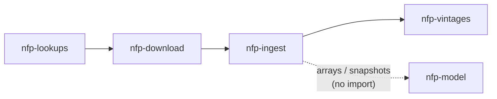
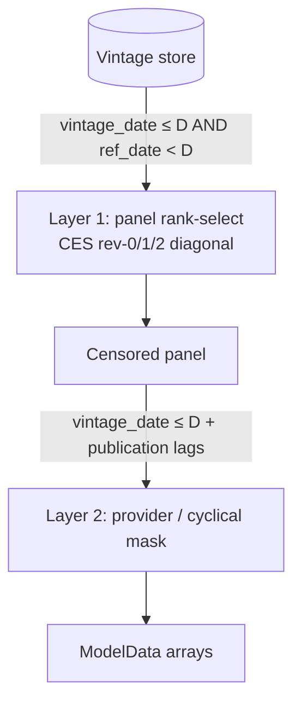
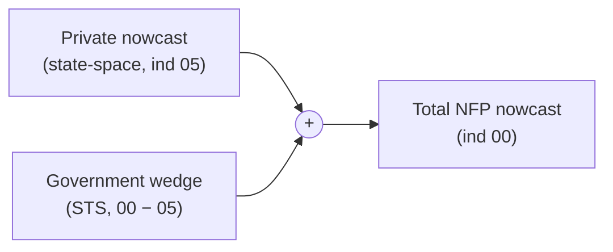

# Documentation Site Implementation Plan

> **For agentic workers:** REQUIRED SUB-SKILL: Use superpowers:subagent-driven-development (recommended) or superpowers:executing-plans to implement this plan task-by-task. Steps use checkbox (`- [ ]`) syntax for tracking.

**Goal:** Build a comprehensive MkDocs + Material + mkdocstrings documentation site for the `alt-nfp` workspace — newcomer onboarding, maintainer architecture reference, a hand-written modeling-methodology record, and an auto-generated per-package API reference.

**Architecture:** A root `mkdocs.yml` drives the Material theme. Hand-written Markdown lives in `docs/`; the API reference is generated at build time by a `mkdocs-gen-files` script (`scripts/gen_api_pages.py`) that walks each workspace package's public `src/` and emits one autodoc stub per module plus a `literate-nav` `SUMMARY.md`. KaTeX renders math, Mermaid renders diagrams. `mkdocs build --strict` is the build gate; `interrogate --fail-under 100` gates public-docstring coverage. Hosting is GitHub Pages via a manual (`workflow_dispatch`) workflow.

**Tech Stack:** MkDocs, mkdocs-material, mkdocstrings[python], mkdocs-gen-files, mkdocs-literate-nav, mkdocs-section-index, interrogate; KaTeX (via `pymdownx.arithmatex`), Mermaid (via `pymdownx.superfences`); uv; pytest.

**Spec:** `specs/documentation_site.md` (finalized design record).

## Global Constraints

- **Work in the worktree** on branch `worktree-docs-site` (already created off `main`).
- **Python** `>=3.12`.
- **Build gate:** `uv run mkdocs build --strict` MUST pass at the end of every task that touches the site — it fails on broken internal links, missing autodoc targets, and unresolved nav entries. Build the `nav` incrementally so it never references a not-yet-created page.
- **Docstrings:** NumPy style only (`docstring_style: numpy`). Coverage target `interrogate --fail-under 100` over public objects.
- **API reference:** per-package, **public only** — skip any path part starting with `_`, skip every `tests/` directory; `scripts/` is not under `src/` and never appears.
- **Math:** KaTeX via `pymdownx.arithmatex: {generic: true}` — never MathJax.
- **Hosting:** the CI workflow triggers on **`workflow_dispatch` only** — never `on: push`.
- **Firewall (HARD):** docstring fills in `nfp-model` are **documentation-only** — never change logic, signatures, behavior, or control flow. Do not edit the logic of `transform_to_panel`, `build_model_data`, `model_data.py`, `first_print.py`, `wedge_data.py`, `a5.py`, or any A1/A2/A3 golden.
- **Commits:** scoped — `git add <exact paths>`, never `git add -A`/`-u`/`.` (the surrounding tree may carry unrelated WIP). End every commit message with:
  `Co-Authored-By: Claude Opus 4.8 <noreply@anthropic.com>`
- **`repo_url`:** `https://github.com/lowmason/alt-nfp`.
- **ruff** already `extend-exclude`s `docs/`, so authored pages are not linted; Python files under `scripts/` and `packages/` still are (line 100; E,W,F,I,B,C4,UP).

---

### Task 1: Scaffold the site

**Files:**
- Create: `mkdocs.yml`
- Create: `docs/index.md`
- Create: `docs/javascripts/katex.js`
- Modify: `.gitignore` (add `/site/`)

**Interfaces:**
- Produces: a buildable site with a Material theme, KaTeX + Mermaid wired, and a single Home page. Later tasks append `nav` entries and `plugins`.

- [ ] **Step 1: Install the docs toolchain**

Run: `uv sync --group docs`
Expected: resolves and installs `mkdocs-material`, `mkdocstrings`, `mkdocs-gen-files`, `mkdocs-literate-nav`, `mkdocs-section-index` into the worktree `.venv`.

- [ ] **Step 2: Create `mkdocs.yml`** (minimal nav; plugins beyond search come in Task 2)

```yaml
site_name: alt-nfp
site_description: Bayesian state-space NFP nowcasting from real-time data vintages
repo_url: https://github.com/lowmason/alt-nfp
repo_name: lowmason/alt-nfp

theme:
  name: material
  features:
    - navigation.tabs
    - navigation.sections
    - navigation.instant
    - navigation.top
    - toc.follow
    - content.code.copy
    - search.suggest
  palette:
    - media: "(prefers-color-scheme: light)"
      scheme: default
      toggle: { icon: material/weather-night, name: Switch to dark mode }
    - media: "(prefers-color-scheme: dark)"
      scheme: slate
      toggle: { icon: material/weather-sunny, name: Switch to light mode }

plugins:
  - search

markdown_extensions:
  - admonition
  - pymdownx.details
  - pymdownx.superfences:
      custom_fences:
        - name: mermaid
          class: mermaid
          format: !!python/name:pymdownx.superfences.fence_code_format
  - pymdownx.arithmatex:
      generic: true
  - pymdownx.highlight
  - toc:
      permalink: true
  - tables

extra_javascript:
  - javascripts/katex.js
  - https://unpkg.com/katex@0/dist/katex.min.js
  - https://unpkg.com/katex@0/dist/contrib/auto-render.min.js
extra_css:
  - https://unpkg.com/katex@0/dist/katex.min.css

nav:
  - Home: index.md
```

- [ ] **Step 3: Create `docs/index.md`** (Home — what alt-nfp is + the three reading paths)

```markdown
# alt-nfp

Bayesian state-space **nonfarm-payroll (NFP) nowcasting** from real-time data
vintages. `alt-nfp` reconstructs what was *knowable on any past date* from
published BLS/QCEW data, then nowcasts the next NFP print with a Bayesian
state-space model — decomposed as **private employment + a government wedge**.

## Three ways to read these docs

- **New here?** Start with [Get Started](get-started/installation.md) — install,
  run the CLI, and produce a nowcast.
- **Maintaining or extending it?** See
  [Architecture & Internals](architecture/package-chain.md) — the package chain,
  boundaries, and storage contract.
- **Here for the method?** See
  [Concepts & Methodology](concepts/vintages-and-censoring.md) — the vintage data
  model and the additive Bayesian nowcast.

The full public API is in the [API Reference](reference/).
```

- [ ] **Step 4: Create `docs/javascripts/katex.js`** (the arithmatex→KaTeX render hook)

```javascript
document$.subscribe(({ body }) => {
  renderMathInElement(body, {
    delimiters: [
      { left: "$$",  right: "$$",  display: true },
      { left: "$",   right: "$",   display: false },
      { left: "\\(", right: "\\)", display: false },
      { left: "\\[", right: "\\]", display: true }
    ],
  })
})
```

- [ ] **Step 5: Ignore the build output**

Add a line `/site/` to `.gitignore` (append; do not rewrite the file).

- [ ] **Step 6: Build under strict mode**

Run: `uv run mkdocs build --strict`
Expected: `INFO - Documentation built in … seconds`, no `WARNING`/`ERROR`. (Strict turns warnings into failures.)

- [ ] **Step 7: Commit**

```bash
git add mkdocs.yml docs/index.md docs/javascripts/katex.js .gitignore
git commit -m "docs(site): scaffold mkdocs-material site with KaTeX + Mermaid

Co-Authored-By: Claude Opus 4.8 <noreply@anthropic.com>"
```

---

### Task 2: Auto-generated per-package API reference

**Files:**
- Create: `scripts/gen_api_pages.py`
- Create: `packages/nfp-vintages/src/nfp_vintages/tests/test_gen_api_pages.py`
- Modify: `mkdocs.yml` (add the gen-files/literate-nav/section-index/mkdocstrings plugins + an API Reference nav entry)

**Interfaces:**
- Produces: `iter_doc_targets(packages_root: Path) -> list[DocTarget]` where `DocTarget(identifier: str, doc_path: str, nav_parts: tuple[str, ...])`. The mkdocs-gen-files glue (`_generate()`) consumes it to emit `reference/<doc_path>` autodoc stubs and `reference/SUMMARY.md`.

- [ ] **Step 1: Write the failing test**

Create `packages/nfp-vintages/src/nfp_vintages/tests/test_gen_api_pages.py`:

```python
"""Unit test for scripts/gen_api_pages.py (the API-ref generator).

Exercises the pure walk/filter (iter_doc_targets) against a synthetic package
tree — no mkdocs build context, no network. Loaded by path because scripts/ is
not on testpaths (mirrors test_bootstrap_store.py).
"""
from __future__ import annotations

import importlib.util

from nfp_lookups.paths import BASE_DIR


def _load_gen():
    path = BASE_DIR / "scripts" / "gen_api_pages.py"
    spec = importlib.util.spec_from_file_location("gen_api_pages", path)
    assert spec and spec.loader, f"cannot load {path}"
    mod = importlib.util.module_from_spec(spec)
    spec.loader.exec_module(mod)  # __name__ == "gen_api_pages" -> no I/O
    return mod


def _make_pkg(tmp_path):
    """A synthetic packages/ tree under one workspace package name."""
    src = tmp_path / "packages" / "nfp-lookups" / "src" / "nfp_lookups"
    src.mkdir(parents=True)
    (src / "__init__.py").write_text("")
    (src / "__main__.py").write_text("")
    (src / "public_mod.py").write_text("def f(): ...")
    (src / "_private.py").write_text("def g(): ...")
    internal = src / "_internal"
    internal.mkdir()
    (internal / "__init__.py").write_text("")
    (internal / "helper.py").write_text("def h(): ...")
    tests = src / "tests"
    tests.mkdir()
    (tests / "__init__.py").write_text("")
    (tests / "test_x.py").write_text("def test_x(): ...")
    return tmp_path / "packages"


def test_iter_doc_targets_public_only(tmp_path):
    gen = _load_gen()
    targets = gen.iter_doc_targets(_make_pkg(tmp_path))
    ids = {t.identifier for t in targets}
    assert "nfp_lookups.public_mod" in ids
    assert "nfp_lookups" in ids  # __init__ -> package index
    assert "nfp_lookups._private" not in ids
    assert not any(i.startswith("nfp_lookups._internal") for i in ids)
    assert not any("tests" in t.nav_parts for t in targets)
    assert not any(i.endswith("__main__") for i in ids)


def test_doc_path_for_init_is_index(tmp_path):
    gen = _load_gen()
    by_id = {t.identifier: t for t in gen.iter_doc_targets(_make_pkg(tmp_path))}
    assert by_id["nfp_lookups"].doc_path == "nfp_lookups/index.md"
    assert by_id["nfp_lookups.public_mod"].doc_path == "nfp_lookups/public_mod.md"
```

- [ ] **Step 2: Run the test to verify it fails**

Run: `uv run pytest packages/nfp-vintages/src/nfp_vintages/tests/test_gen_api_pages.py -v`
Expected: FAIL/ERROR — `scripts/gen_api_pages.py` does not exist yet, so `exec_module` raises.

- [ ] **Step 3: Create `scripts/gen_api_pages.py`**

```python
#!/usr/bin/env python3
"""Generate the per-package API reference (an mkdocs-gen-files script).

Run automatically by the mkdocs-gen-files plugin during ``mkdocs build`` via
``runpy.run_path``, which sets ``__name__`` to ``"<run_path>"``. Walks each
workspace package's public ``src/`` and emits one virtual reference page per
module plus a literate-nav ``SUMMARY.md``. Public-only: modules / sub-packages
whose name starts with ``_`` and any ``tests`` directory are skipped (``scripts/``
is not under ``src/`` and never appears).

The pure walk (``iter_doc_targets``) is import-safe so it can be unit-tested
without a mkdocs build context.
"""
from __future__ import annotations

from dataclasses import dataclass
from pathlib import Path

# Dependency-chain order; each maps to packages/<dist-name>/src/<import-name>.
WORKSPACE_PACKAGES: tuple[str, ...] = (
    "nfp_lookups",
    "nfp_download",
    "nfp_ingest",
    "nfp_vintages",
    "nfp_model",
)


@dataclass(frozen=True)
class DocTarget:
    """One reference page to emit."""

    identifier: str             # dotted module, e.g. "nfp_ingest.vintage_store"
    doc_path: str               # under reference/, e.g. "nfp_ingest/vintage_store.md"
    nav_parts: tuple[str, ...]  # nav key, e.g. ("nfp_ingest", "vintage_store")


def _is_public(parts: tuple[str, ...]) -> bool:
    """True iff no path part is private (``_``-prefixed) or a ``tests`` dir."""
    return not any(p == "tests" or p.startswith("_") for p in parts)


def iter_doc_targets(packages_root: Path) -> list[DocTarget]:
    """Walk every workspace package under *packages_root* into public DocTargets.

    *packages_root* is the repo's ``packages/`` directory. For each package,
    walks ``packages/<dist>/src`` and yields one target per public module, with
    ``__init__.py`` mapped to the package's ``index.md`` and ``__main__.py``
    skipped.
    """
    targets: list[DocTarget] = []
    for import_name in WORKSPACE_PACKAGES:
        dist_name = import_name.replace("_", "-")
        src = packages_root / dist_name / "src"
        if not src.is_dir():
            continue
        for path in sorted(src.rglob("*.py")):
            parts = tuple(path.relative_to(src).with_suffix("").parts)
            if parts[-1] == "__main__":
                continue
            if parts[-1] == "__init__":
                parts = parts[:-1]
                if not parts:
                    continue
                doc_path = "/".join(parts) + "/index.md"
            else:
                doc_path = "/".join(parts) + ".md"
            if not _is_public(parts):
                continue
            targets.append(DocTarget(".".join(parts), doc_path, parts))
    return targets


def _generate() -> None:
    """Emit the reference pages + SUMMARY.md into the mkdocs build."""
    import mkdocs_gen_files

    root = Path(__file__).resolve().parent.parent  # repo root
    nav = mkdocs_gen_files.Nav()
    for target in iter_doc_targets(root / "packages"):
        nav[target.nav_parts] = target.doc_path
        with mkdocs_gen_files.open(f"reference/{target.doc_path}", "w") as fd:
            fd.write(f"::: {target.identifier}\n")
    with mkdocs_gen_files.open("reference/SUMMARY.md", "w") as fd:
        fd.writelines(nav.build_literate_nav())


# mkdocs-gen-files runs this file via runpy.run_path -> __name__ == "<run_path>";
# a direct `python` run gives "__main__". Generate under both. Under importlib
# import (the unit test) __name__ is the module name, so the import is
# side-effect-free.
if __name__ in ("__main__", "<run_path>"):
    _generate()
```

- [ ] **Step 4: Run the test to verify it passes**

Run: `uv run pytest packages/nfp-vintages/src/nfp_vintages/tests/test_gen_api_pages.py -v`
Expected: 2 passed.

- [ ] **Step 5: Wire the plugins + API nav into `mkdocs.yml`**

Replace the `plugins:` block with:

```yaml
plugins:
  - search
  - gen-files:
      scripts: [scripts/gen_api_pages.py]
  - literate-nav:
      nav_file: SUMMARY.md
  - section-index
  - mkdocstrings:
      handlers:
        python:
          options:
            docstring_style: numpy
            show_root_heading: true
            show_source: true
            show_signature_annotations: true
            members_order: source
            filters: ["!^_"]
```

Append to `nav:`:

```yaml
  - API Reference: reference/
```

- [ ] **Step 6: Build and VERIFY the API ref is non-empty**

Run: `uv run mkdocs build --strict`
Expected: builds with no warnings. Then verify pages were actually generated:
Run: `ls site/reference/nfp_lookups/ && grep -rl "::: nfp_" site/reference/ | head`
Expected: the reference tree exists and contains rendered module pages. **If `site/reference/` is empty, the gen-files guard did not fire** — confirm `runpy.run_path` semantics and fix the guard before proceeding (do not ship an empty API ref).

- [ ] **Step 7: Commit**

```bash
git add scripts/gen_api_pages.py \
        packages/nfp-vintages/src/nfp_vintages/tests/test_gen_api_pages.py \
        mkdocs.yml
git commit -m "docs(site): auto-generate per-package public API reference

Co-Authored-By: Claude Opus 4.8 <noreply@anthropic.com>"
```

---

### Task 3: Docstring completion + `interrogate` coverage gate

**Files:**
- Modify: `pyproject.toml` (`[dependency-groups] docs` += `interrogate`; add `[tool.interrogate]`)
- Modify: source files across packages to add missing **public** NumPy docstrings (≈34; `nfp_model` first)

**Interfaces:**
- Produces: `uv run interrogate -c pyproject.toml` reports 100% over the configured public surface — a regression gate for the API reference.

- [ ] **Step 1: Add `interrogate` + config to `pyproject.toml`**

Append `"interrogate>=1.7.0"` to the `[dependency-groups] docs` list, and add:

```toml
[tool.interrogate]
fail-under = 100
ignore-init-method = true
ignore-magic = true
ignore-private = true
ignore-semiprivate = true
ignore-property-decorators = true
ignore-nested-functions = true
ignore-module = true
exclude = ["packages/*/src/*/tests", "scripts", "docs", "build", "dist"]
verbose = 1
```

Run: `uv sync --group docs`
Expected: `interrogate` installed.

- [ ] **Step 2: Baseline — list the gaps**

Run: `uv run interrogate -c pyproject.toml packages`
Expected: coverage < 100%; `-v` lists each undocumented public object (functions, classes, methods). `nfp_model` is the weakest.

- [ ] **Step 3: Fill `nfp_model` docstrings first**

For each undocumented public object interrogate names in `nfp_model`, read the object and add a NumPy-style docstring (`Summary`, then `Parameters`/`Returns` sections where it takes args / returns). **Documentation-only — never change code.** Re-run `uv run interrogate -c pyproject.toml packages/nfp-model` until it reports 100% for that package.

- [ ] **Step 4: Fill remaining repo-wide gaps**

Repeat Step 3 across the other packages until the gate is green. **Close the gap by writing docstrings — never by loosening the `[tool.interrogate]` ignores** (only the categories already listed — magic/private/semiprivate/init/nested/property/module/tests/scripts — are exempt).

- [ ] **Step 5: Verify the gate + no breakage**

Run: `uv run interrogate -c pyproject.toml packages`
Expected: `RESULT: PASSED (minimum: 100.0%, actual: 100.0%)`.
Run: `uv run pytest -m "not network and not slow" --no-cov`
Expected: the suite still passes (docstrings are inert; this confirms no accidental edits broke an import).

- [ ] **Step 6: Build the API ref with full docstrings**

Run: `uv run mkdocs build --strict`
Expected: builds; reference pages now show prose, not bare signatures.

- [ ] **Step 7: Commit** (scope the exact edited files — list them explicitly from `git status`)

```bash
git add pyproject.toml <each source file you edited>
git commit -m "docs(api): fill public docstrings to 100% + interrogate gate

Co-Authored-By: Claude Opus 4.8 <noreply@anthropic.com>"
```

---

### Task 4: Get Started pages

**Files:**
- Create: `docs/get-started/installation.md`, `docs/get-started/quickstart.md`, `docs/get-started/data-story.md`
- Modify: `mkdocs.yml` (add the `Get Started` nav section)

**Source material (read for accurate facts):** root `CLAUDE.md` (Commands, Hard rules), `.env.example`, `specs/cli_production_workflow.md`.

- [ ] **Step 1: Write `installation.md`** — must include: `uv sync` (+ `--group docs` for docs); the five-package workspace and the linear chain; the env contract — `NFP_STORE_URI`, `NFP_SNAPSHOTS_URI`, `NFP_DATA_URI`, `NFP_PROVIDERS_URI`, `AWS_*` in a gitignored `.env`, each unset ⇒ local `data/` fallback; the `.env` gotcha (an ad-hoc process that doesn't load `.env` reads the empty local store).

- [ ] **Step 2: Write `quickstart.md`** — must include: `uv run alt-nfp --help`; `uv run alt-nfp status` (store coverage / alarms); `uv run alt-nfp update --as-of <date>` (capture + append); `uv run alt-nfp watch --source all` (cron trigger). State that `bootstrap_store.py` is a one-time script, not a CLI command (link the CLI Reference page).

- [ ] **Step 3: Write `data-story.md`** — must include: the vintage store lives in MinIO/S3, not on disk; `data/` is proprietary + gitignored and this repo is public; tests self-skip when the store is unavailable; network tests are `@pytest.mark.network`; examples in these docs use synthetic/illustrative data, never real vintages.

- [ ] **Step 4: Add the nav section** to `mkdocs.yml` (after `Home`):

```yaml
  - Get Started:
      - Installation: get-started/installation.md
      - Quickstart: get-started/quickstart.md
      - The data story: get-started/data-story.md
```

- [ ] **Step 5: Build under strict mode**

Run: `uv run mkdocs build --strict`
Expected: builds; all three pages and internal links resolve.

- [ ] **Step 6: Commit**

```bash
git add docs/get-started/ mkdocs.yml
git commit -m "docs(site): Get Started — install, quickstart, data story

Co-Authored-By: Claude Opus 4.8 <noreply@anthropic.com>"
```

---

### Task 5: Architecture & Internals pages

**Files:**
- Create: `docs/architecture/package-chain.md`, `docs/architecture/boundaries-and-paths.md`, `docs/architecture/storage-contract.md`
- Modify: `mkdocs.yml` (add the `Architecture & Internals` nav section)

**Source material:** root `CLAUDE.md` (Workspace table, Hard rules), each package `CLAUDE.md`, `ARCHITECTURE.md`.

- [ ] **Step 1: Write `package-chain.md`** — the five packages + roles (from the `CLAUDE.md` Workspace table), and the Mermaid dependency-chain diagram:

````markdown

````

State that `nfp-model` imports **no** `nfp_*` package, and that importing it enables global float64.

- [ ] **Step 2: Write `boundaries-and-paths.md`** — must include: no upward imports (lookups must not import download, etc.); no cross-package imports of underscore-private names; all filesystem layout comes from `nfp_lookups.paths` (override root with `NFP_BASE_DIR`); never construct data paths in other packages.

- [ ] **Step 3: Write `storage-contract.md`** — must include: the container-storage contract (no code writes under `./data`); the env URIs (`NFP_STORE_URI`/`NFP_SNAPSHOTS_URI`/`NFP_DATA_URI`/`NFP_PROVIDERS_URI`) each with a local fallback; `storage_options_for` + the `is_remote` mkdir guard; rebuild-to-scratch then promote-deliberately (copy-then-delete cutover; `is_canonical_store` guard); `bootstrap_store.py` is the one-time rebuild, never a CLI `build`.

- [ ] **Step 4: Add the nav section** to `mkdocs.yml` (after `Concepts & Methodology` will be inserted later; for now place after `Get Started`):

```yaml
  - Architecture & Internals:
      - The package chain: architecture/package-chain.md
      - Boundaries & paths: architecture/boundaries-and-paths.md
      - Storage contract: architecture/storage-contract.md
```

- [ ] **Step 5: Build under strict mode**

Run: `uv run mkdocs build --strict`
Expected: builds; the Mermaid diagram renders (check `mkdocs serve` once).

- [ ] **Step 6: Commit**

```bash
git add docs/architecture/ mkdocs.yml
git commit -m "docs(site): Architecture — package chain, boundaries, storage contract

Co-Authored-By: Claude Opus 4.8 <noreply@anthropic.com>"
```

---

### Task 6: Methodology — Vintage data model & Additive Framework overview

**Files:**
- Create: `docs/concepts/vintages-and-censoring.md`, `docs/concepts/additive/overview.md`
- Modify: `mkdocs.yml` (add the `Concepts & Methodology` nav section, before `Architecture & Internals`)

**Source material:** `specs/documentation_site.md` (methodology scope), `nfp_ingest/vintage_store.py`, `nfp_ingest/panel_adapter.py`, the benchmark-splice growth convention, root `CLAUDE.md`.

- [ ] **Step 1: Write `vintages-and-censoring.md`** — must include: what a real-time *vintage* is; the Hive-partitioned store keyed by `source` × `seasonally_adjusted`; **two-layer as-of censoring** — Layer 1 panel-level rank-based selection (triangular CES rev-0/1/2 diagonal; benchmark-revision filtering) and Layer 2 model-level `vintage_date` filtering (provider + cyclical publication lags). Include the Mermaid censoring-flow diagram:

````markdown

````

- [ ] **Step 2: Write `additive/overview.md`** — must include: the identity **Total NFP = Private(`'05'`) nowcast + Government wedge(`00 − 05`)**; why `'05'` is the modeling target; why `'00'` total is decomposed not modeled directly; how total-NFP consensus maps onto the framework; one line that the internal code term "Track A / Track B" = the private / government components. Include the additive-decomposition Mermaid diagram:

````markdown

````

- [ ] **Step 3: Add the nav section** to `mkdocs.yml`, placed **before** `Architecture & Internals` (the data→model→architecture spine):

```yaml
  - Concepts & Methodology:
      - Vintage data model & as-of censoring: concepts/vintages-and-censoring.md
      - Additive Nowcast Framework:
          - Overview: concepts/additive/overview.md
```

- [ ] **Step 4: Build under strict mode**

Run: `uv run mkdocs build --strict`
Expected: builds; both Mermaid diagrams render.

- [ ] **Step 5: Commit**

```bash
git add docs/concepts/vintages-and-censoring.md docs/concepts/additive/overview.md mkdocs.yml
git commit -m "docs(methods): vintage data model + additive framework overview

Co-Authored-By: Claude Opus 4.8 <noreply@anthropic.com>"
```

---

### Task 7: Methodology — Private State-Space Model & Government Wedge

**Files:**
- Create: `docs/concepts/additive/private-state-space.md`, `docs/concepts/additive/government-wedge.md`
- Delete: `docs/government_design.md` (its content folds into the Government Wedge page)
- Modify: `mkdocs.yml` (extend the `Additive Nowcast Framework` nav)

**Source material:** `nfp_model/*` (model definition), `nfp_model` `benchmark.py` / `benchmark_backtest.py`, the government-wedge module, the existing `docs/government_design.md` (28 KB — read in full and fold it).

- [ ] **Step 1: Write `private-state-space.md`** — the math centerpiece, KaTeX-rendered. Must cover, drawn from the actual model code: the latent NFP state with an **AR(1)** core; the **Fourier-GRW seasonal**; the **QCEW Student-t anchor**; the **structural birth/death** term; the **cyclical indicators** (claims, NFCI, biz-apps, JOLTS) with publication lags (claims=1mo, nfci=1mo, biz_apps=2mo, jolts=2mo); the **precision budget**. Render the BD term in KaTeX, e.g.:

```markdown
$$ \mathrm{BD}_t = \varphi_0 + \varphi_1 X^{\text{birth}}_t + \varphi_2 \mathrm{BD}^{\text{QCEW}}_t + \varphi_3 X^{\text{cycle}}_t + \sigma_{\text{bd}}\,\xi_t $$
```

End with an H2 subsection **"Benchmark revision decomposition"**: the annual CES re-anchoring to QCEW; how `benchmark.py` extracts the revision from this model's posterior and decomposes it into **continuing-units + birth/death**. **Methodology-only** — mention the T-12…T-1 horizon backtest as the *validation mechanism*; do **not** publish accuracy numbers.

- [ ] **Step 2: Write `government-wedge.md`** — fold `docs/government_design.md`. Must include: the thin **Bayesian change-space STS** forecasting the wedge `00 − 05` (not published `90`); **announcement-priored interventions** (RIF magnitudes). Render any state equations in KaTeX.

- [ ] **Step 3: Remove the stray design doc**

Run: `git rm docs/government_design.md`
(Its content now lives in `government-wedge.md`.)

- [ ] **Step 4: Extend the nav** under `Additive Nowcast Framework` in `mkdocs.yml`:

```yaml
          - The Private State-Space Model: concepts/additive/private-state-space.md
          - The Government Wedge: concepts/additive/government-wedge.md
```

- [ ] **Step 5: Build under strict mode**

Run: `uv run mkdocs build --strict`
Expected: builds; KaTeX renders the equations (verify once with `mkdocs serve`); no link to the removed `government_design.md` remains.

- [ ] **Step 6: Commit**

```bash
# Step 3's `git rm` already staged the government_design.md deletion; this
# commit captures it alongside the two new pages and the nav change.
git add docs/concepts/additive/private-state-space.md \
        docs/concepts/additive/government-wedge.md mkdocs.yml
git commit -m "docs(methods): private state-space model + government wedge

Folds docs/government_design.md into the Government Wedge page.

Co-Authored-By: Claude Opus 4.8 <noreply@anthropic.com>"
```

---

### Task 8: CLI Reference

**Files:**
- Create: `docs/cli-reference.md`
- Modify: `mkdocs.yml` (add the `CLI Reference` nav entry)

**Source material:** `specs/cli_production_workflow.md`, `specs/plans/completed/` plan 16, `packages/nfp-vintages/src/nfp_vintages/__main__.py`, `scripts/bootstrap_store.py`.

- [ ] **Step 1: Write `cli-reference.md`** — document each `alt-nfp` command (`update`, `status`, `watch`) with its purpose, key flags, and a usage example; explain the production monthly path (real-time current-print capture + append) and the `status` health report (coverage, uncaptured/corrected alarms, the `LOCAL FALLBACK` warning). Add a clearly-separated section for `scripts/bootstrap_store.py` — the one-time historical rebuild + promote, **not** a CLI command — with its `--scratch`/`--canonical` usage and the scratch-then-promote safety model.

- [ ] **Step 2: Add the nav entry** to `mkdocs.yml` (after `Architecture & Internals`):

```yaml
  - CLI Reference: cli-reference.md
```

(Confirm `API Reference: reference/` remains the last nav entry.)

- [ ] **Step 3: Build under strict mode**

Run: `uv run mkdocs build --strict`
Expected: builds; the page and links resolve.

- [ ] **Step 4: Commit**

```bash
git add docs/cli-reference.md mkdocs.yml
git commit -m "docs(site): CLI reference (alt-nfp commands + bootstrap script)

Co-Authored-By: Claude Opus 4.8 <noreply@anthropic.com>"
```

---

### Task 9: Hosting — manual GitHub Pages workflow

**Files:**
- Create: `.github/workflows/docs.yml`

**Interfaces:**
- Produces: a manually-triggered (`workflow_dispatch`) CI job that strict-builds and `gh-deploy`s the site.

- [ ] **Step 1: Create `.github/workflows/docs.yml`**

First read the existing `.github/workflows/ci.yml` and **mirror its uv-setup steps verbatim** (the `actions/checkout` + uv-install action and pinned version, plus any `python-version`/cache config) so the two workflows stay consistent. Then use that setup in this workflow shape (replace the `checkout`/`setup-uv` lines below with ci.yml's exact equivalents):

```yaml
name: docs

on:
  workflow_dispatch:

permissions:
  contents: write

jobs:
  deploy:
    runs-on: ubuntu-latest
    steps:
      # <-- mirror ci.yml's checkout + uv-setup steps here -->
      - name: Install docs toolchain
        run: uv sync --group docs
      - name: Strict build (gate)
        run: uv run mkdocs build --strict
      - name: Coverage gate
        run: uv run interrogate -c pyproject.toml packages
      - name: Publish to gh-pages
        run: uv run mkdocs gh-deploy --force
```

- [ ] **Step 2: Validate the workflow locally**

Run: `uv run mkdocs build --strict && uv run interrogate -c pyproject.toml packages`
Expected: both green (the workflow's gates pass locally). (The `gh-deploy` step itself runs only in CI / on a deliberate local `uv run mkdocs gh-deploy`.)

- [ ] **Step 3: Commit**

```bash
git add .github/workflows/docs.yml
git commit -m "ci(docs): manual (workflow_dispatch) GitHub Pages publish

Co-Authored-By: Claude Opus 4.8 <noreply@anthropic.com>"
```

- [ ] **Step 4: User action (NOT automatable)**

Enabling GitHub Pages (Settings → Pages → source = `gh-pages` branch) is a repository-settings change the implementer must NOT make on the user's behalf. Surface it: after the first `gh-deploy` pushes the `gh-pages` branch, the user enables Pages in repo settings. The first publish is a deliberate `workflow_dispatch` run (or a local `uv run mkdocs gh-deploy`), per the manual-publish decision.

---

## Notes for the executor

- **Branch:** all work lands on `worktree-docs-site` in the worktree; open the PR against `main` when the plan is complete.
- **Incremental nav:** never add a `nav:` entry before its page exists — `--strict` will fail. Each task adds only its own pages + nav.
- **Strict build is the contract** for the prose tasks (4–8): there is no unit test, so a clean `mkdocs build --strict` plus a one-time `mkdocs serve` visual check (diagrams/math render) is the deliverable.
- **Prose accuracy:** the methodology pages must reflect the *actual* model code — read the named source files; do not paraphrase from memory.
